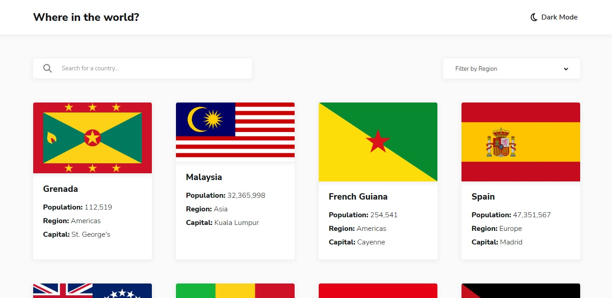

# Frontend Mentor challenge - REST Countries API with color theme switcher solution using React

This project is my solution for [Frontend Mentor's challenge](https://www.frontendmentor.io/challenges/rest-countries-api-with-color-theme-switcher-5cacc469fec04111f7b848ca).

## Table of Contents

- [Overview](#overview)
  - [The challenge](#the-challenge)
  - [Screenshot](#screenshot)
  - [Links](#links)
- [My process](#my-process)
  - [Built with](#built-with)
  - [Personal notes](#personal-notes)
- [Author](#author)

## Overview

This challenge is to build a website with integration of [REST API](https://restcountries.com) to pull country data, filter, and display them (plus theme switcher).

### The challenge

In this project, users will be able to:

- See all countries from the API on the homepage
- Search for a country using an `input` field
- Filter countries by region
- Click on a country to see more detailed information on a separate page
- Click through to the border countries on the detail page
- Toggle the color scheme between light and dark mode

### Screenshot

### Links

- Solution URL: [Frontend Mentor Solution Page](https://www.frontendmentor.io/solutions/rest-countries-api-with-color-theme-switcher-rdoEajHl4c)
- Live Site URL: [Space Tourism Website](https://rest-countries-api-kiflanadli.vercel.app/)

## My process

### Built with

- React js
- SCSS
- React helmet
- React router
- CSS grid
- Flexbox

### Personal notes

There's some mechanism I forgot to add, i.e.

- animation when elements on hovered
- message when country is not found with search input

I'd like to add them when I got the time.
Also, the select HTML tag for filtering isn't really great to style, because it's an element which visually depends on the user's OS device, so I will use modal with custom component in the future.

## Author

- Website - [Kiflan Adli](https://kiflanadli.github.io)
- Frontend Mentor - [@kiflanadli](https://www.frontendmentor.io/profile/kiflanadli)
